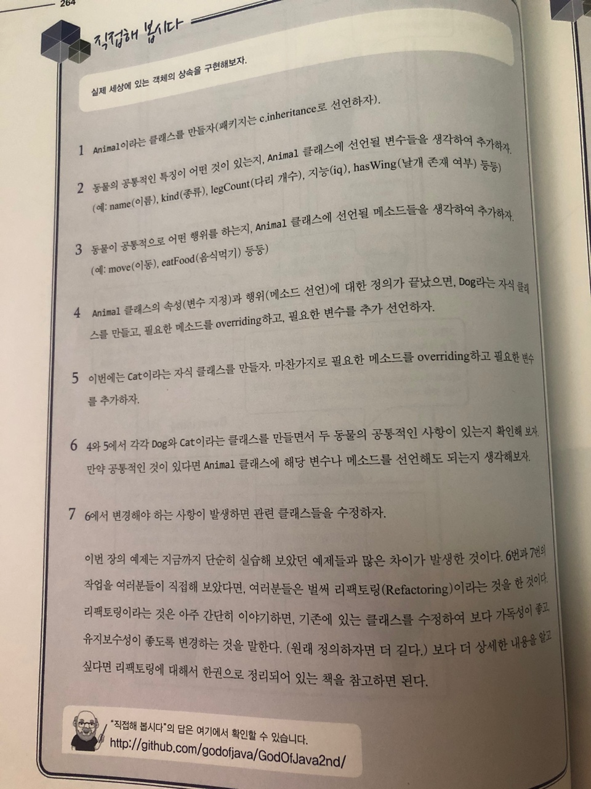

# 직접해 봅시다

# 정리해 봅시다
1. 상속을 받는 클래스의 선언문에 사용하는 예약어는 무엇인가요?

   > extends

2. 상속을 받은 클래스의 생성자를 수행하면 부모의 생성자도 자동으로 수행된다.

   > O

3. 부모 클래스의 생성자를 자식 클래스에서 직접 선택하려고 할 때 사용하는 예약어는 무엇인가요?

   > super

4. 메소드 Overriding과 Overloading을 정확하게 설명해 보세요.

   > 오버로딩(Overloading) : 같은 이름의 메서드 여러개를 가지면서 매개변수의 유형과 개수가 다르도록 하는 기술
   > 오버라이딩(Overriding) : 상위 클래스가 가지고 있는 메서드를 하위 클래스가 재정의해서 사용

5. A가 부모, B가 자식 클래스라면 A a = new B(); 의 형태로 객체 생성이 가능한가요?

   > O (다형성)

6. 명시적으로 형변환을 하기 전에 타입을 확인하려면 어떤 예약어를 사용해야 하나요?

   > instanceof

7. 위의 문제에서 사용한 예약어의 좌측에는 어떤 값이, 우측에는 어떤 값이 들어가나요?

   > instanceof의 왼쪽에는 참조변수를 오른쪽에는 타입(클래스명)

8. instanceof 예약어의 수행 결과는 어떤 타입으로 제공되나요?

   > boolean

9. Polymorphism이라는 것은 뭔가요?

   > 다형성(polymorphism)이란 하나의 객체가 여러 가지 타입을 가질 수 있는 것을 의미합니다.다형성은 상속, 추상화와 더불어 객체 지향 프로그래밍을 구성하는 중요한 특징 중 하나입니다. 자바에서는 이러한 다형성을 부모 클래스 타입의 참조 변수로 자식 클래스 타입의 인스턴스를 참조할 수 있도록 하여 구현하고 있습니다.
