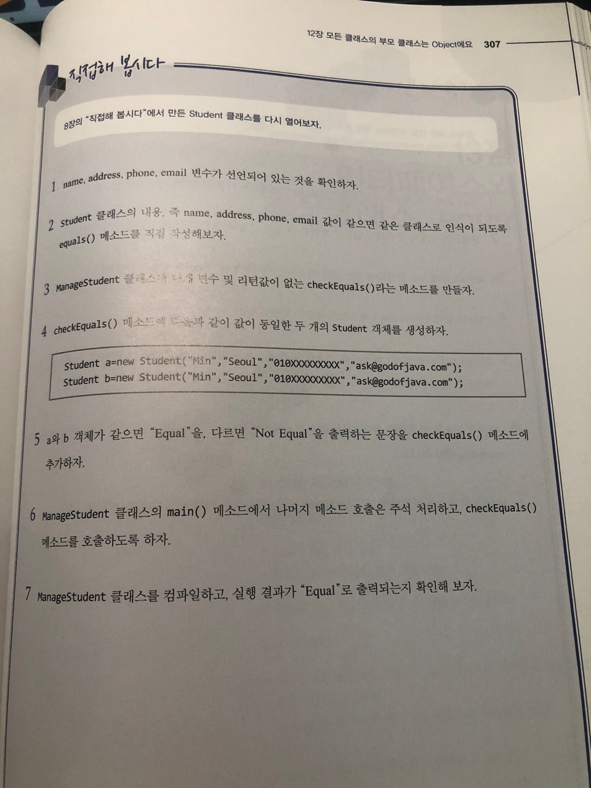

# 직접해 봅시다

# 정리해 봅시다
1. 모든 클래스의 최상위 부모 클래스인 Object 클래스는 어떤 패키지에 선언되어 있나요 ?

   > java.lang

2. 클래스가 어떻게 선언되어 있는지 확인할 수 있는 명령어(실행파일)의 이름은 무엇인가요?

   > javap
   
3. Object 클래스에 선언되어 있는 모든 메소드를 Overriding해야 하나요?

   > 아니요

4. Object 클래스의 clone() 메소드의 용도는 무엇인가요?

   > 복제

5. System.out.println() 메소드를 사용하여 클래스를 출력했을 때 "최종적으로" 호출되는 Object 클래스에 있는 메소드는 무엇인가요?

   > toString();

6. 객체의 주소를 비교하는 것이 아닌, 값을 비교하려면 Object 클래스에 선언되어 있는 어떤 메소드를 overrding해야 하나요?

   > equals

7. Object 클래스에 선언되어 있는 hashCode()라는 메소드는 어떤 타입의 값을 리턴 하나요?

   > int
