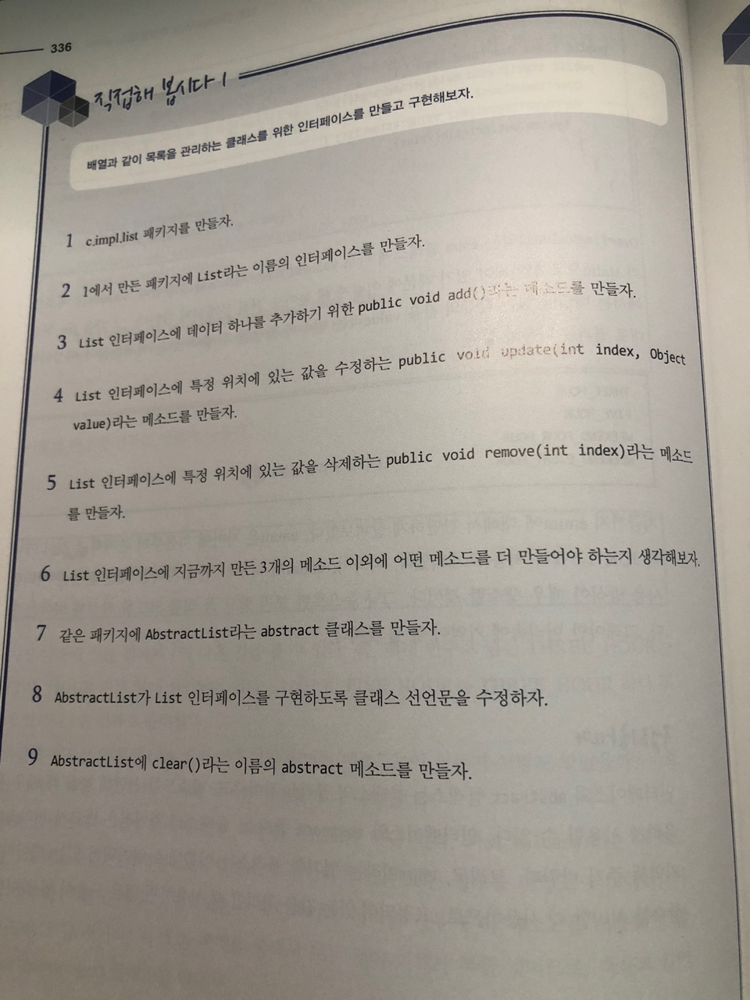
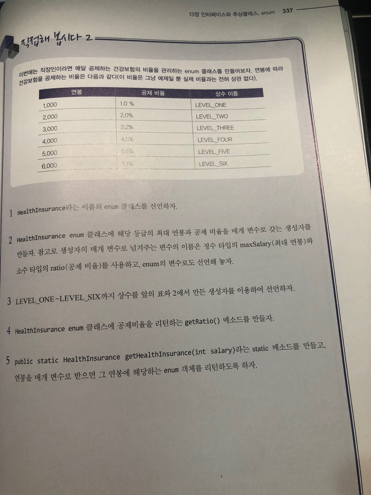
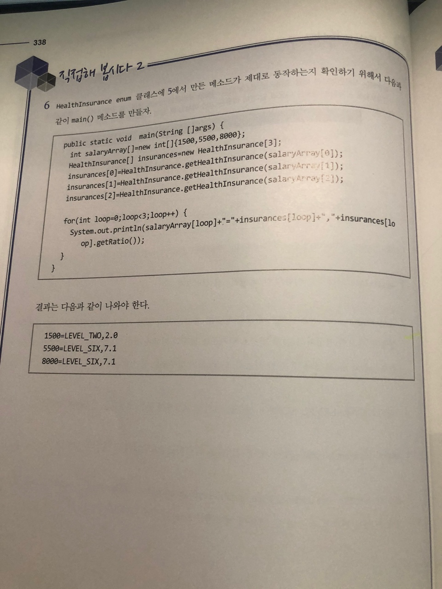

# 직접해 봅시다

# 정리해 봅시다
1. 인터페이스에 선언되어 있는 메소드는 body(몸통)이 있어도 되나요?

   > X

2. 인터페이스를 구현하는 클래스의 선언시 사용하는 예약어는 무엇인가요?

   > implements

3. 메소드의 일부만 완성되어 있는 클래스를 무엇이라고 하나요?

   > 추상클래스

4. 위에 있는 문제의 답에 있는 클래스에 body(몸통)이 없는 메소드를 추가하려면 어떤 예약어를 추가해야 하나요?

   > abstract

클래스를 final로 선언하면 어떤 제약이 발생하나요?

   > extends 불가

메소드를 final로 선언하면 어떤 제약이 발생하나요?

   > override 불가

변수를 final로 선언하면 어떤 제약이 발생하나요?

   > 변경불가

enum 클래스 안에 정의하는 여러 개의 상수들을 나열하기 위해서 상수 사이에 사용하는 기호는 무엇인가요?

   > ,

enum 으로 선언한 클래스는 어떤 클래스의 상속을 자동으로 받게 되나요?

   > Enum

enum 클래스에 선언되어 있지는 않지만 컴파일시 자동으로 추가되는. 상수의 목록을 배열로 리턴하는 메소드는 무엇인가요?

   > values
