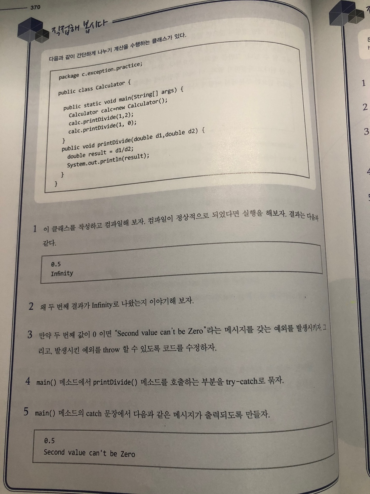

# 직접해 봅시다

# 정리해 봅시다
1. 예외를 처리하기 위한 세가지 블록에는 어떤 것이 있나요?

   > try catch finally

2. 첫번째 문제의 답 중에서 "여기에서 예외가 발생할 것이니 조심하세요"라고 선언하는 블록은 어떤 블록인가요?

   > try

3. 첫번째 문제의 답 중에서 "예외가 발생하던 안하던 얘는 반드시 실행되어야 됩니다."라는 블록은 어떤 블록인가요?

   > finally

4. 예외의 종류 세가지는 각각 무엇인가요?

   > error, unchecked exception, checked exception

5. 프로세스에 치명적인 영향을 주는 문제가 발생한 것을 무엇이라고 하나요?

   > error

6. try나 catch 블록 내에서 예외를 발생시키는 예약어는 무엇인가요?

   > throw

7. 메소드 선언시 어떤 예외를 던질 수도 있다고 선언할 때 사용하는 키워드는 무엇인가요?

   > throws

8. 직접 예외를 만들 때 어떤 클래스의 상속을 받아서 만들어야만 하나요?

   > RuntimeException

