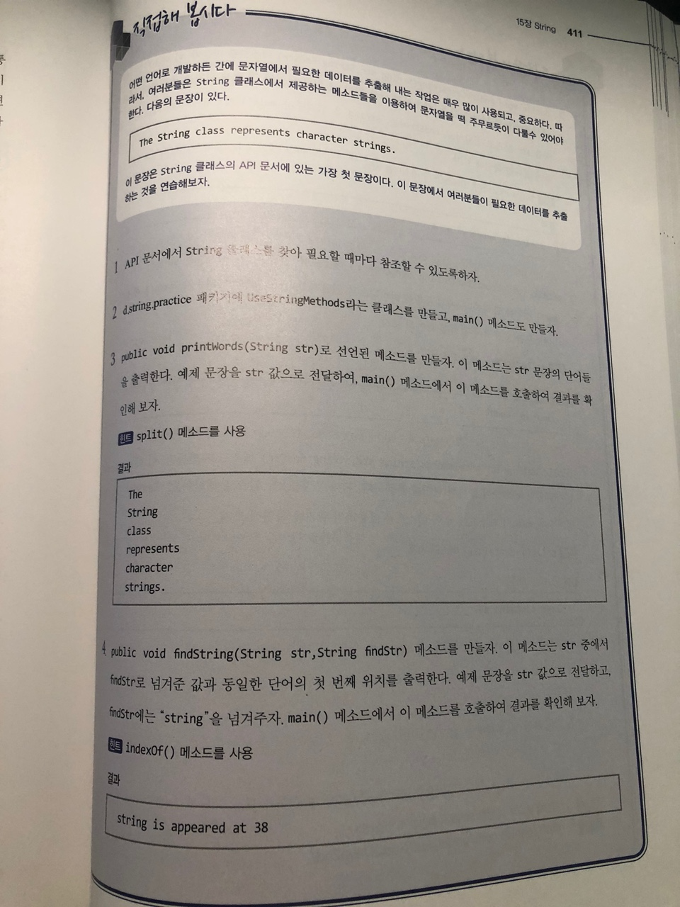
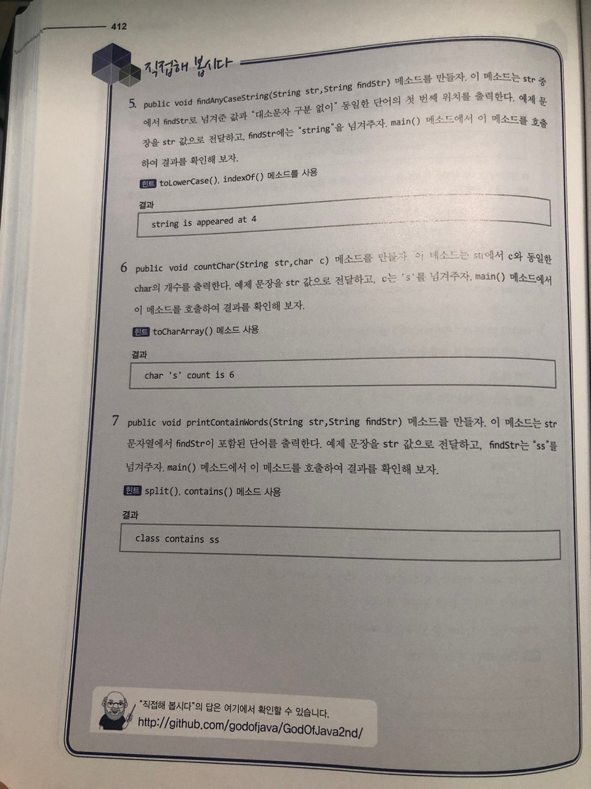

# 직접해 봅시다

# 정리해 봅시다
1. String 클래스는 final 클래스인가요? 만약 그렇다면, 그 이유는 무엇인가요?

   > 더 이상 이 클래스를 확장 할 수 없게 하기 위해서
   
2. String 클래스가 구현한 인터페이스에는 어떤 것들이 있나요?

   > Serializable, Comparable, CharSequence

3. String 클래스의 생성자 중에서 가장 의미없는 (사용할 필요가 없는) 생성자는 무엇인가요?

    > 기본생성자

4. String 문자열을 byte 배열로 만드는 메소드의 이름은 무엇인가요?

    > getBytes()

5. String 문자열의 메소드를 호출하기 전에 반드시 점검해야 하는 사항은 무엇인가요?

    > null

6. String 문자열의 길이를 알아내는 메소드는 무엇인가요?

    > length()

7. String 클래스의 equals() 메소드와 compareTo() 메소드의 공통점과 차이점은 무엇인가요?

    > 공통점은 객체의 주소값이 아닌 값만 가지고 비교한다는 것이고 리턴값은 다르다 equals() 는 boolean compareto()는 같을떈 0 다를땐 문자들의 차이의 값

8. 문자열이 "서울시"로 시작하는지를 확인하려면 String의 어떤 메소드를 사용해야 하나요?

    > startsWith()

9. 문자열에 "한국"이라는 단어의 위치를 찾아내려고 할 때에는 String의 어떤 메소드를 사용해야 하나요?

    > indexOf()
   
10. 위의 문제의 답에서 "한국"이 문자열에 없을 때 결과값은 무엇인가요?

    > -1

11. 문자열의 1번째부터 10번째 위치까지의 내용을 String으로 추출하려고 합니다. 어떤 메소드를 사용해야 하나요?

    > substring()

12. 문자열의 모든 공백을  표시로 변환하려고 합니다. 어떤 메소드를 사용하는 것이 좋을까요?

    > replaceAll

13. String의 단점을 보완하기 위한 두개의 클래스는 무엇인가요?

    > StringBuffer StringBuilder

14. 문제의 답에서 문자열을 더하기 위한 메소드의 이름은 무엇인가요?

    > append
