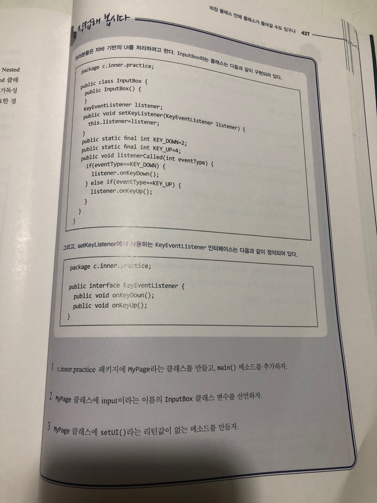
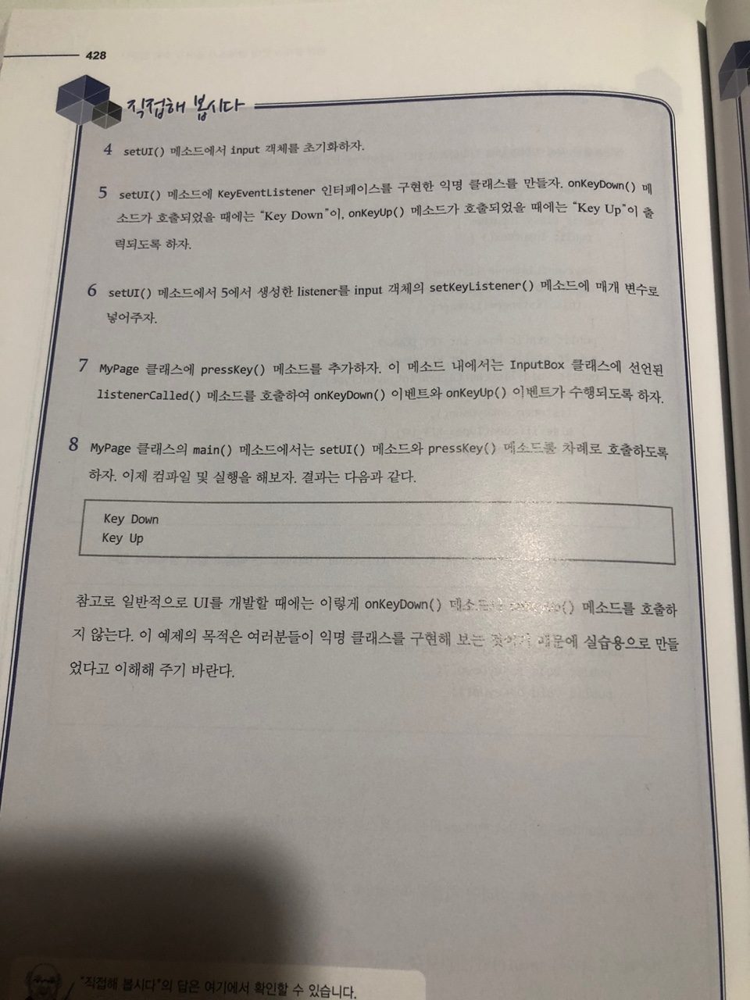

# 직접해 봅시다

# 정리해 봅시다
1. Nested 클래스에 속하는 3가지 클래스에는 어떤 것들이 있나요?

    > static nested class, local inner class, anonymous inner class

2. Nested 클래스를 컴파일하면 Nested클래스 파일의 이름은 어떻게 되나요?

   > 앞에 $ 붙는다

3. Static Nested 클래스는 다른 Nested 클래스와 어떤 차이가 있나요?

   > 인스턴스 없이 내부 클래스의 인스턴스를 바로 생성할 수 있다는 차이

4. StaticNested 클래스의 객체 생성은 어떻게 하나요?

   > new Class.InnerClass

5. 일반적인 내부 클래스의 객체 생성은 어떻게 하나요?

   > mc.new InnerClass()

6. Nested 클래스를 만드는 이유는 무엇인가요?

   > 코드를 간단하게 표현하기 위함

7. Nested 클래스에서 감싸고 있는 클래스의 private 로 선언된 변수에 접근할 수 있나요?

   > O
   
8. 감싸고 있는 클래스에서 Nested 클래스에 선언된 private 로 선언된 변수에 접근할 수 있나요?

   > X
