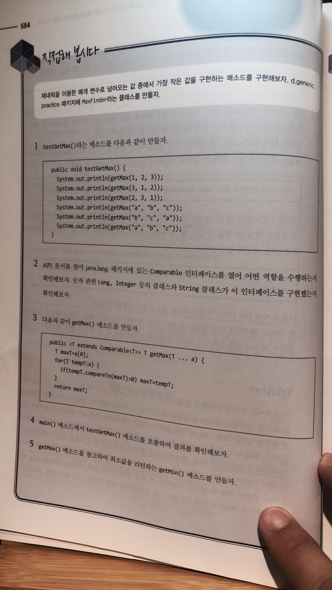
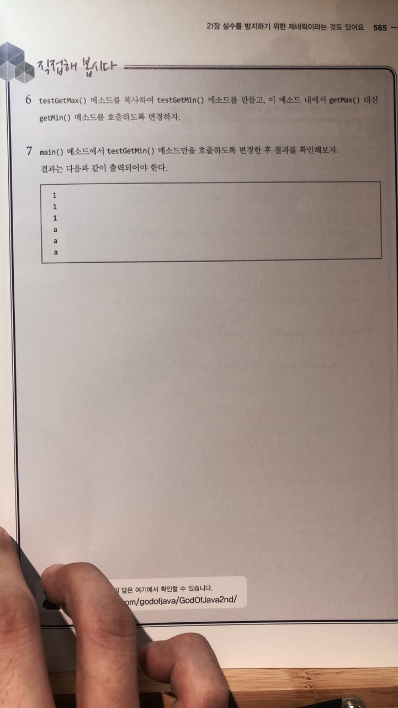

# 직접해 봅시다

# 정리해 봅시다
1. 제네릭이 자바에 추가된 이유는 무엇인가요?
   > 타입만 다르고 코드의 내용이 대부분 일치할 때, 코드의 재사용성이 좋아진다.
   > 제네릭은 타입 형 병환에서 발생할 수 있는 문제점을 "사전"에 없애기 위해서 만들어졌다.

2. 제네릭 타입의 이름은 T나 E 처럼 하나의 캐릭터로만 선언되어야 하나요?

   > 제네릭의 선언시 타입 이름은 예약어만 아니면 어떤 단어도 사용할 수 있다. 단, 일반적으로 대문자로 시작한다.

3. 메소드에서 제네릭 타입을 명시적으로 지정하기 애매할 경우에는 < > 안에 어떤 기호를 넣어 주어야 하나요?

   > ? 를 제네릭 선언 꺽쇠 사이에 넣으면 Wildcard로 어떤 타입도 올 수 있다.

4. 메소드에서 제네릭 타입을 명시적으로 지정하기에는 애매하지만, 어떤 클래스의 상속을 받은 특정 타입만 가능하다는 것은 나타내려면 < > 안에 어떤 기호를 넣어 주어야 하나요?

   > 특정 타입으로 제네릭을 제한하고 싶을 때에는 "? extends 타입"을 제네릭 선언 안에 넣으면 된다.

5. 제네릭 선언시 wildcard라는 것을 선언했을 때 어떤 제약사항이 있나요?

   > Wildcard 타입을 Object 타입으로만 사용해야 한다.

6. 메소드를 제네릭하게 선언하려면 리턴타입 앞에 어떤 것을 추가해 주면 되나요?

   > 꺽쇠 안에 원하는 제네릭 타입을 명시함으로써 제네릭한 메소드를 선언할 수 있다.
