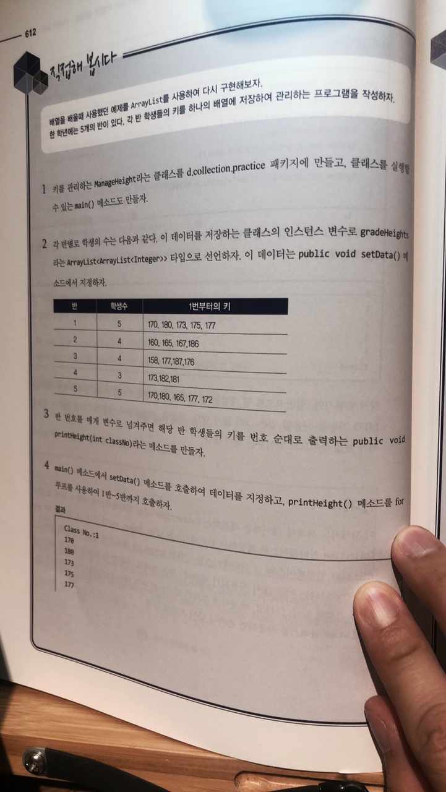
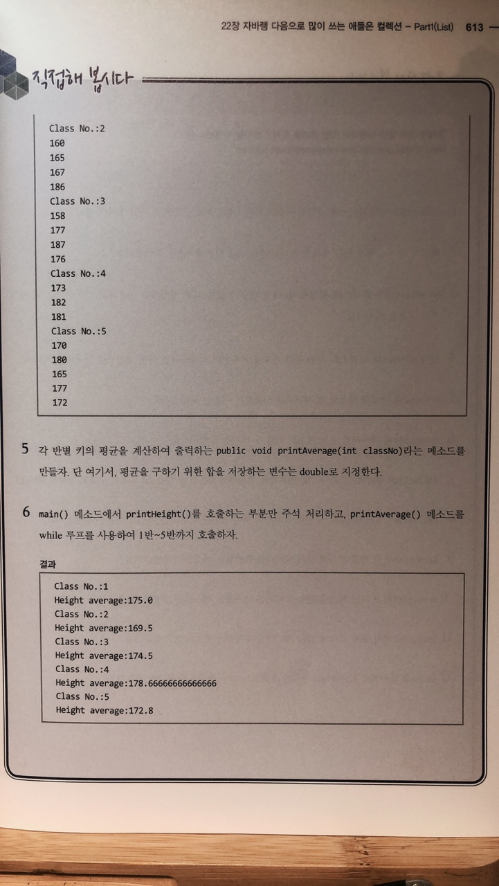

# 직접해 봅시다




# 정리해 봅시다
1. Collection 인터페이스를 구현하는 대표적인 3개의 자료구조에는 어떤 것들이 있나요?

   > List , Set , Queue

2. 배열과 같이 순서가 있는 목록형을 나타내는 대표 인터페이스는 무엇인가요?

   > List

3. ArrayList라는 클래스의 생성자 중 매개변수가 없는 기본 생성자를 사용하면 기본적으로 몇 개의 저장공간을 가지나요?

   > 10

4. 만약 ArrayList 클래스의 저장 공간 개수를 처음부터 지정하려면 어떤 생성자를 사용하면 되나요?

   > ArrayList(int 공간개수);

5. ArrayList 객체를 생성할 때 제네릭을 사용하는 이유는 무엇인가요?

   > 컴파일 시 타입을 잘못 지정한 부분을 거럴낼 수 있기 때문에

6. ArrayList에 데이터를 담는 메소드 두가지의 이름은 무엇인가요?

   > add(), addAll()

7. Collection 인터페이스를 구현한 클래스의 객체에서 사용할 수 있는 for 루프의 구조는 어떻게 되나요? 코드를 작성하세요.
```java
    List<String> list = new ArrayList<>();
    
    for(String data:list) {
        System.out.println(data);
    }
```

8. Collection 인터페이스를 구현한 클래스의 객체에 저장된 데이터의 갯수를 확인하는 메소드 이름은 무엇인가요?

   > size()

9. ArrayList에서 특정 위치에 있는 데이터를 확인하는 메소드는 무엇인가요?

   > indexOf()

10. ArrayList에서 특정 위치에 있는 데이터를 삭제하는 메소드는 무엇인가요?

   > remove()

11. ArrayList에서 특정 위치에 있는 데이터를 수정하는 메소드는 무엇인가요?

   > set()

12. java.util 패키지에 있는 Stack 이라는 클래스는 어떤 클래스를 확장한 것인가요?

   > List 인터페이스를 구현하고 Vector 클래스를 상속

13. Stack 클래스에서 데이터를 담는 메소드는 무엇인가요?

   > push()

14. Stack 클래스에서 가장 위에 있는 데이터를 확인만 하는 메소드는 무엇인가요?

   > peek()

15. Stack 클래스에서 가장 위에 있는 데이터를 삭제하고 리턴하는 메소드는 무엇인가요?

   > pop()
