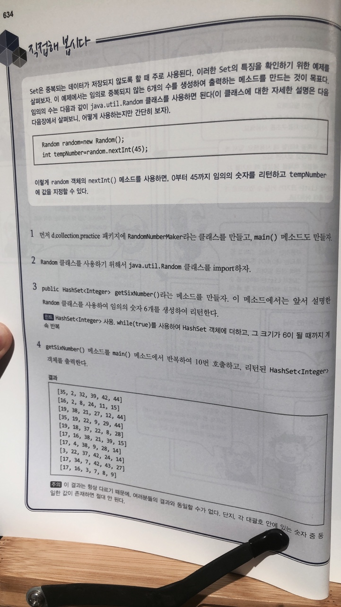

# 직접해 봅시다

# 정리해 봅시다
1. 순서와 상관 없는 여러 데이터를 하나의 객체에 저장할 때 사용하는 Collection의 하위 인터페이스는 무엇인가요?

   > Set

2. HashSet 클래스는 생성자를 통하여 저장 가능한 데이터의 초기 크기를 지정할 수 있나요?

   > O
   > 따로 지정하지 않으면 16

3. HashSet 클래스의 객체에 데이터를 추가하는 메소드는 무엇인가요?

   > add()

4. HashSet 클래스의 객체에 어떤 데이터가 존재하는지 확인하는 메소드는 무엇인가요?

   > contains()

5. HashSet 클래스의 객체에 어떤 데이터를 삭제하는 메소드는 무엇인가요?

   > remove()

6. Queue는 FIFO를 처리하기 위한 클래스들의 인터페이스 입니다. FIFO는 무슨 단어의 약어인가요?

   > First In First Out

7. Deque는 무슨 단어의 약어이며, 용도는 무엇인가요?

   > Double ended Queue

8. LinkedList 클래스의 특징을 이야기해 봅시다.

   > 연결 리스트, 링크드 리스트(linked list)는 각 노드가 데이터와 포인터를 가지고 한 줄로 연결되어 있는 방식으로 데이터를 저장하는 자료 구조이다. 이름에서 말하듯이 데이터를 담고 있는 노드들이 연결되어 있는데, 노드의 포인터가 다음이나 이전의 노드와의 연결을 담당하게 된다.
   > 파일로 저장할 때에는 어떤 메소드들을 사용하면 되나요?
