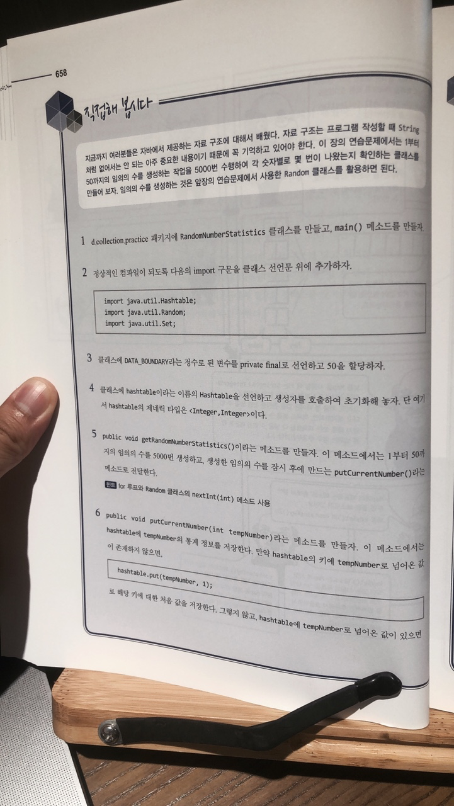
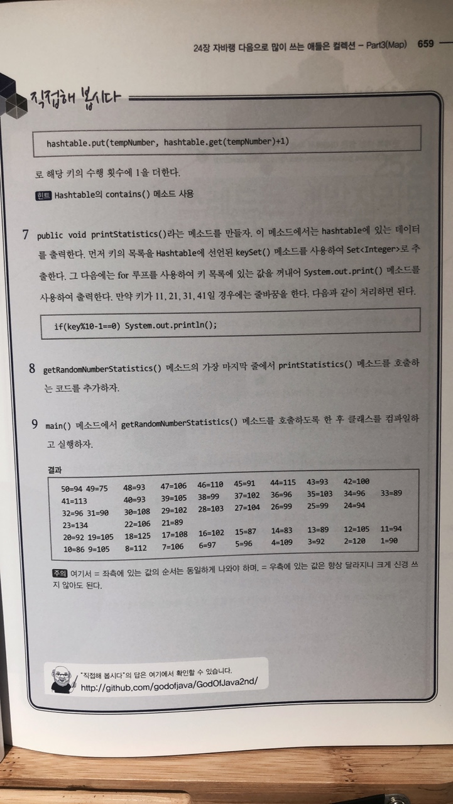

# 직접해 봅시다

# 정리해 봅시다
1. Map 형태의 자료구조는 무엇과 무엇으로 구성되어 있나요?

   > 키 값

2. Map에서 데이터를 저장하는 메소드는 무엇인가요?

   > put()

3. Map에서 특정 키에 할당된 값을 가져오는 메소드는 무엇인가요?

   > get(키값);

4. Map에서 특정 키와 관련된 키와 데이터를 지우는 메소드는 무엇인가요?

   > remove()

5. Map에서 키의 목록을 가져오는 메소드는 무엇인가요?

   > keySet()

6. Map에 저장되어 있는 데이터의 크기를 가져오는 메소드는 무엇인가요?

   > size()

7. HashMap과 Hashtable 중에서 키나 값에 null을 저장할 수 있는 것은 무엇인가요?

   > HashMap

8. HashMap과 Hashtable 중에서 여러 쓰레드에서 동시에 접근해도 문제가 없는 것은 무엇인가요?

   > Hashtable

9. HashMap에서 특정 키가 존재하는지 확인하는 메소드는 무엇인가요?

   > containsKey(키값)

이 장에서 살펴본 클래스 중, 키가 저장되면서 정렬되는 Map에는 어떤 것이 있나요?

   > TreeMap

10. Properties 클래스는 어떤 클래스를 확장한 것인가요?

   > Hashtable

11. Properties 클래스의 객체에 있는 데이터를 파일로 저장할 때에는 어떤 메소드들을 사용하면 되나요?
   > store
