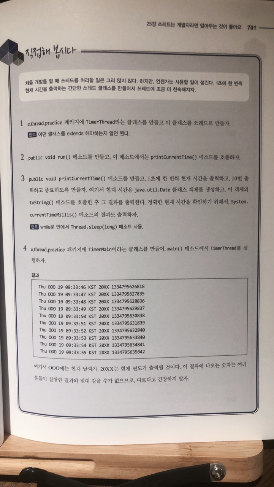
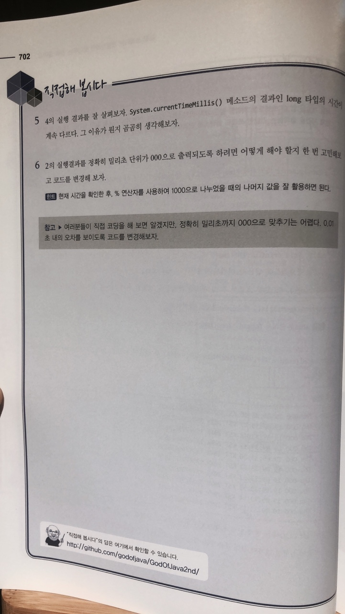

# 직접해 봅시다

# 정리해 봅시다
1. 쓰레드와 프로세스의 차이를 이야기 해 보세요.

   > 프로세스는 운영체제로부터 자원을 할당받는 작업의 단위이고
   스레드는 프로세스가 할당받은 자원을 이용하는 실행의 단위입니다.
   프로세스는 실행될 때 운영체제로부터 프로세서를 할당받고, 운영되기 위해 필요한 주소 공간, 메모리 등 자원을 할당받습니다.
   스레드란 한 프로세스 내에서 동작되는 여러 실행의 흐름으로, 프로세스 내의 주소 공간이나 자원들을 같은 프로세스 내에 스레드끼리 공유하면서 실행됩니다.

3. 위의 문제에서 이야기한 인터페이스에 선언되어 있는 유일한 메소드는 무엇인가요?

   > Runnable

4. 쓰레드 클래스를 만들기 위해서 어떤 클래스를 확장하면 되나요?

   > Runnable

5. 쓰레드가 시작되는 메소드의 이름은 무엇인가요?

   > run()

6. 쓰레드를 시작하는 메소드의 이름은 무엇인가요?

   > start()

7. 쓰레드에 선언되어 있는 sleep() 메소드의 역할은 무엇인가요?

   > 특정 시간동안 Thread가 정지

8. sleep() 메소드를 사용할 때 try-catch 로 감싸 주어야 하는 이유는 무엇인가요?

   > sleep() 메소드로 대기하고 있는 중에 interrupt가 될 수 있으므로, InterruptedException 이 발생할 수 있다.

9. 데몬(Daemon) 쓰레드와 일반 쓰레드의 차이는 무엇인가요?

   > 데몬 쓰레드는 만약 프로세스가 종료되는 상황이 되었을때 해당 쓰레드가 종료되지 않아도 다른 실행중인 일반 쓰레드가 없다면 해당 쓰레드는 중지된다.

10. synchronized 구문은 왜 써 주며, 어디에 사용해야 하나요?

   > synchronized 구문은 동시에 여러 쓰레드에서 하나의 값에 접근하려고 할 때 데이터의 정합성을 지키기 위해서 사용한다.
   그러므로, 여러 쓰레드에서 동시에 접근할 일이 있을 경우에만 써야한다. 그렇지 않으면 성능상 큰 문제가 발생할 수 있다.

11. synchronized 를 사용하는 두 가지 방법은 어떤 것 인가요?

   > syhchronized는 메소드 자체를 synchronized로 선언하는 방법과
   메소드 내에 필요한 부분만 synchronized로 선언하는 방법이

12. 쓰레드의 상태에는 어떤 것들이 있나요?

   > 쓰레드의 상태는 NEW, RUNNABLE, BLOCKED, WAITING, TIMED_WAITING, TERMINATED

13. 쓰레드에 선언되어 있는 join() 메소드의 용도는 무엇인가요?

   > join()메소드는 해당 쓰레드가 종료될 때까지 대기한다.

14. 쓰레드에 선언되어 있는 interrupt() 메소드의 용도는 무엇인가요?

   > interrupt() 메소드는 해당 쓰레드를 종료시킨다.

15. interrupt() 메소드를 호출하면 해당 쓰레드는 어떤 상태에 있을 때 interrupt() 메소드가 호출된 효과가 발생 되나요?

   > sleep(), join(), wait() 메소드가 호출되어 대기중인 상태에만 interrupt() 메소드가 처리된다

16. Object 클래스에 선언된 wait() 메소드의 용도는 무엇인가요?

   > wait() 메소드는 다른 쓰레드가 Object 객체에 대한 notify() 메소드나 notifyAll() 메소드를 호출할 때까지
   현재 쓰레드가 대기하고 있도록 한다.
   만약 매개변수로 시간을 지정하면 wait() 메소드와 동일하지만, 해당 시간까지만 대기한다.

17. Object 클래스에 선언된 notify() 메소드의 용도는 무엇인가요?

   > notify() 메소드는 wait() 메소드로 대기중인 쓰레드가 계속해서 작업을 하도록 깨우는 작업을 한다.

18. ThreadGroup 클래스에 선언된 enumerate() 메소드의 용도는 무엇인가요?

   > ThreadGroup의 enumerate() 메소드는 해당 쓰레드 그룹에 포함된 쓰레드나 쓰레드 그룹의 목록을 매개변수로 넘어온 배열에 담는다. 

