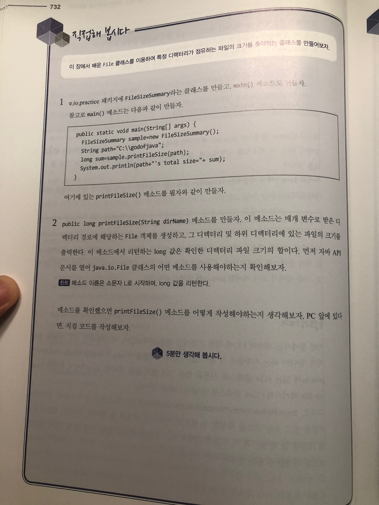
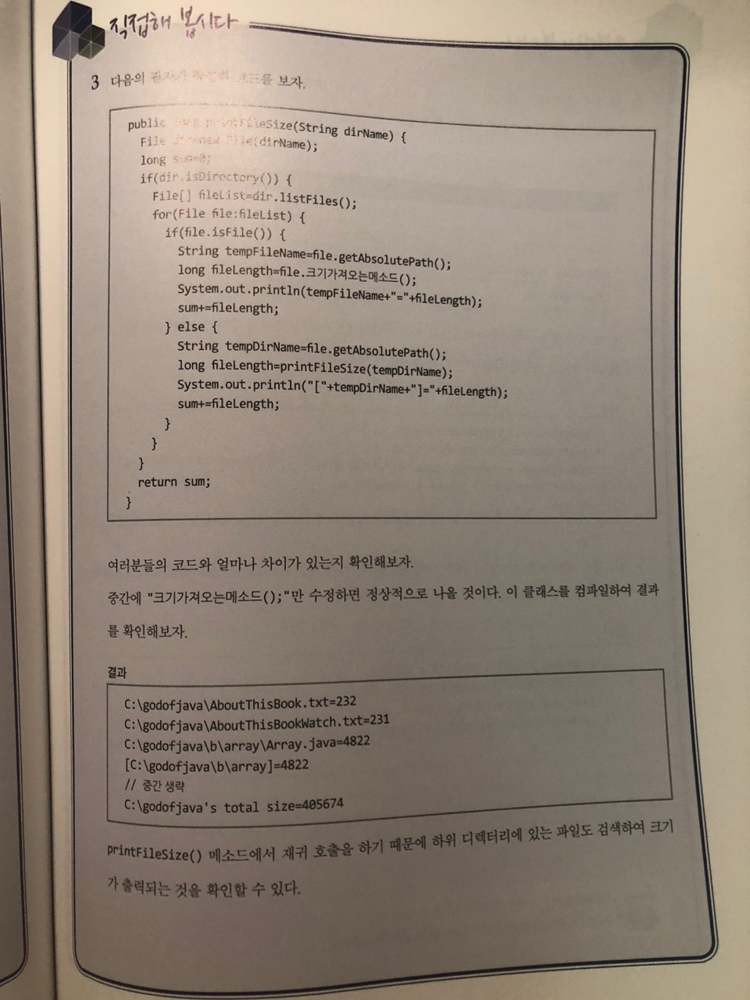

# 직접해 봅시다

# 정리해 봅시다
1. I/O는 각각 무엇의 약자인가요?

   > Input Output

2. java.io.File 클래스는 파일만 지정할 수 있나요?

   > X

3. OS 마다 다른 경로 구분자를 처리하기 위해서는 File 클래스의 어떤 상수를 사용해야 하나요?

   > File.separator

4. File 클래스에서 디렉터리를 만드는 mkdir()과 mkdirs() 메소드의 차이는 무엇인가요?

   > mkdir 메소드는 디렉터리를 하나만 만들고 mkdirs 메소드는 여러개의 하위 디렉터리를 만든다

5. File 클래스의 list() 메소드와 listFiles() 메소드의 차이는 무엇인가요?

   > list() 메소드의 경우 리턴값이 String 배열이며 listFiles()메소드의 경우는 리턴값이 File의 배열이다

6. FileFilter와 FilenameFilter의 차이는 무엇인가요?

   > FileFilter매개 변수로 넘어온 File객체가 조건에 맞는지 확인 FilenameFilter는 매개 변수로 넘어온 디렉터리에 있는 경로나 파일 이름이 조건에 맞는지 확인

7. InputStream 이라는 abstract 클래스는 어떤 작업을 하기 위해서 만들어 진 것인가요?

   > 스트림에서 바이트를 읽기 위해서

8. OutputStream 이라는 abstract 클래스는 어떤 작업을 하기 위해서 만들어 진 것인가요?

   > 스트림에서 바이트를 쓰기 위해서

9. Reader 라는 abstract 클래스는 어떤 작업을 하기 위해서 만들어 진 것인가요?

   > 문자열을 읽기 위해서

10. Writer 라는 abstract 클래스는 어떤 작업을 하기 위해서 만들어 진 것인가요?

   > 문자열을 쓰기 위해서

11. BufferedReader나 BufferedWriter를 사용하는 이유는 무엇인가요?

   > Writer 객체를 버퍼라는 공간을 사용해서 효율적으로 저장히기 위해

12. 파일을 읽고, 문자열을 처리하기 위해서 필요한 Scanner 클래스가 속해있는 패키지는 무엇인가요?

   > java.util
