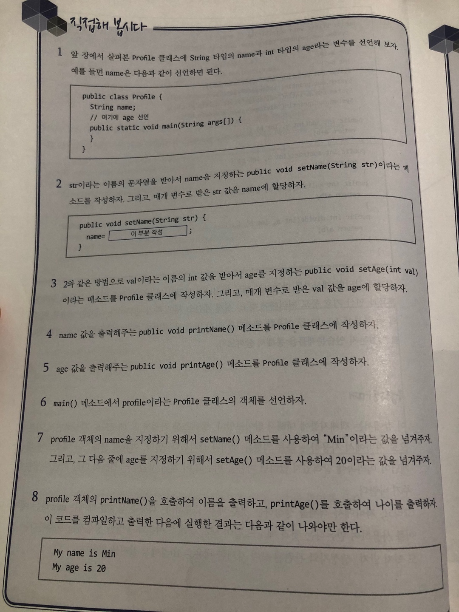

# 직접해 봅시다



# 정리해 봅시다
1. 클래스와 객체의 차이점을 말해 주세요.

    > 클래스는 설계도, 객체는 설계도를 바탕으로 만들어낸 구체적이고 실질적인 건축물에 비유할 수 있을 것 같다. 붕어빵 틀과 붕어빵. 클래스는 그 자체로 어떤 작업을 수행하지 않고 객체를 생성해서 사용할 수 있다.

2. 객체를 생성하기 위해서 꼭 사용해야 하는 예약어는 뭐라고 했죠?

    > new

    >클래스 클래스이름 = new 생성자();
    >
    >Profile profile = new Profile(); 

3. 객체를 생성하기 위해서 사용하는 메소드 같이 생긴 클래스 이름에 소괄호가 있는 것을 뭐라고 하나요?

    > 생성자. 기본 생성자는 직접 만들어주지 않아도 컴파일 할 때 자동으로 만들어진다.

```java
public class Test {
	public Test() {

	}
}
```

4. 객체의 메소드를 사용하려면 어떤 기호를 객체 이름과 메소드 이름 사이에 넣어주어야 하나요?

    > .

5. 여러분들이 메소드를 사용하기 위해서는 어떤 것을 만들어야 하나요?

    > 객체 , 인스턴스

6. 5번 문제에서 만들어야 하는 것은 어떤 예약어를 사용하고, 클래스의 무엇을 사용해야 하나요?

    > new 예약어와 클래스의 생성자를 통해 객체를 만들어 객체가 가지고 있는 메소드를 사용할 수 있다.

