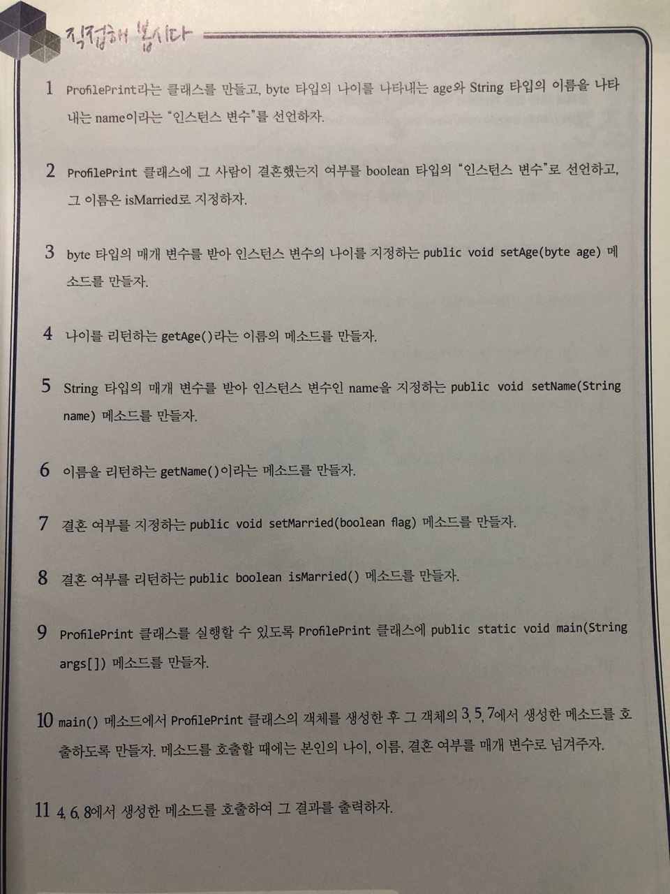

# 직접해 봅시다

# 정리해 봅시다

1. 네 가지 종류의 변수는 어떻게 구분할 수 있나요?
    >지역 변수 : 중괄호 안에서 선언된 변수.\
    >매개 변수 : 메소드에 넘겨주는 변수.\
    >인스턴스 변수 : 메소드 밖에, 클래스 안에 선언된 변수.\
    >인스턴스 변수 앞에 static을 붙이면 클래스 변수다.\
    >클래스 변수 : 인스턴스 변수 중 static 예약어를 사용한 변수

2. 변수의 이름을 지을 때 대문자로 시작해도 되나요?

    > 변수의 이름을 지을 때 대문자로 시작해도 컴파일 과정에서 에러가 발생하지는 않으나 camelCase 카멜 표기법에 따라 변수 이름을 짓는 것이 보편적이다. 값이 변하지 않는 상수의 경우 대문자로 짓는 것이 일반적이다.

3. 자료형에는 기본 자료형과 어떤 자료형이 있나요?
    > 참조 자료형. 참조 자료형은 new 예약어를 이용해 생성한다. String은 제외.

4. 기본 자료형에는 몇가지가 있나요?

    > 8가지. byte, short, int, long, char, float, double, boolean.

5. 기본 자료형 중 정수형에는 어떤 것들이 있나요?

    > byte, short, int, long, char

6. byte는 몇 비트(bit)로 되어 있나요?

    > 8비트

7. byte는 왜 만들었을까요?
    > 적은 공간에 보다 많은 내용을 저장할 수 있기 때문에

8. int와 long 중 어떤 타입이 더 큰 숫자를 처리할 수 있나요?

    > long이 더 큰 숫자를 처리할 수 있다. int는 2의 32승 만큼의 숫자를, long은 2의 64승 만큼의 숫자를 표현할 수 있다.

9. 소수점을 처리하는 타입은 어떤 것이 있나요?

    > float, double. float은 32비트, double은 64비트로 표현할 수 있다.

10. char는 정수형인가요?

    > char는 정수형이지만 보통 문자를 처리할 때 사용한다.

11. a라는 것을 char로 정의할 때 어떤 기호로 감싸주어야 하나요?

    > 홑따옴표 ''

12. true와 false 두개의 값만을 가지는 타입은 어떤 것인가요?

    > boolean
