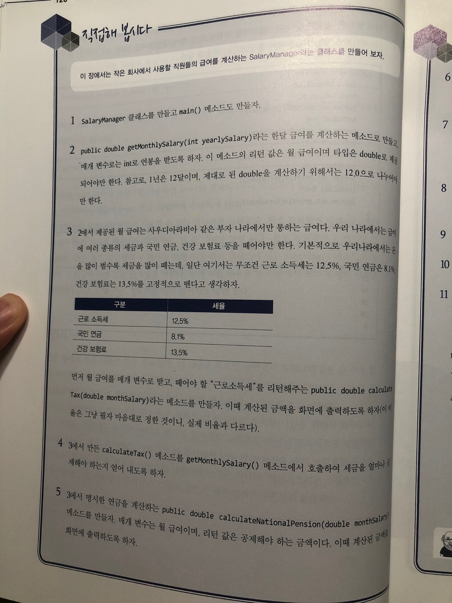
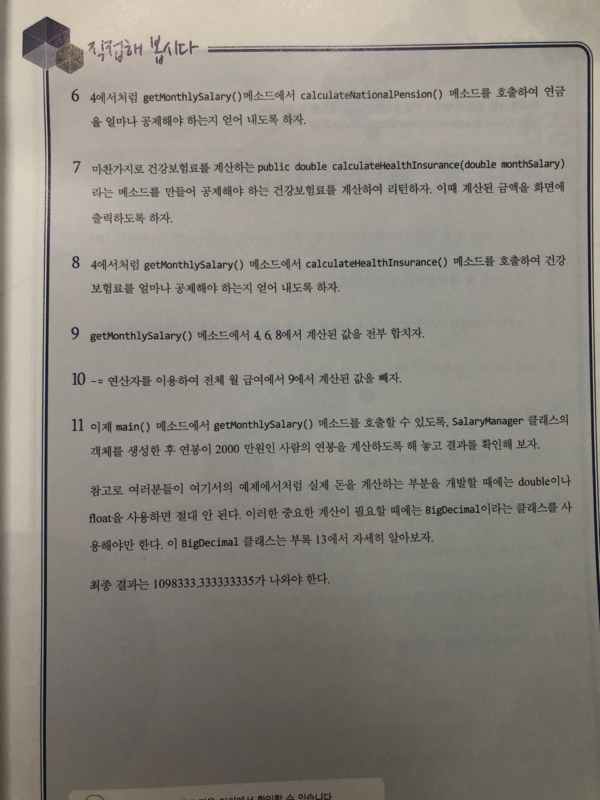

# 직접해 봅시다




# 정리해 봅시다

1. 값을 할당할 떄 사용하는 연산자의 기호는 무엇인가요?
    > =
    
2. 기본적인 덧셈, 뺼셈, 곱셈 나눗셈, 나머지를 계싼할 때 사용하는 연산자의 기호는 무엇인가요?

    > +, -, *, /, %

3. +=는 무엇을 할 때 사용하는 연산자 인가요?

    > int a=a+1; 을 int a += 1; 로 나타내 줄수 있게 해주는 복합대입 연산자

4. 여러분들이 연산의 순서를 모르거나 확실히 하고 싶을때에는 어떤 기호를 사용해야 하나요?

    > ()

5. ==와 !=의 차이는 무엇인가요?

    > ==은 같은지 비교, !=는 다른지 비교
   
6. < <=의 차이는 무엇인가요?

    > <는 미만, <=는 이하
   
7. ! 연산자는 어떤 타입에 사용할 수 있나요?

    > boolean

8. ? : 로 표시하는 삼항 여산자의 ? : 뒤에 명시에 주는 값은 무엇을 의마하나요?

    > ? 앞의 조건이 true일 경우 ?과 : 사이의 값을 리턴하고
    > 
    >false일 경우 : 뒤의 값을 리턴한다
    (조건식) ? true일 경우 : false일 경우

9. 자바는 형 변환을 한다고 했는데, short의 값을 long에 할당할 때에는 어떤것을 해 주어야 하나요?

    > (long)으로 형 변환을 해주어야 한다
    > long a = 1L;
    > short b = (short)a;
   
10. 반대로 long 값을 short에 할당할 때에는 어떤것을 해 주어야 하나요?

    > (short)으로 형 변환을 해주어야 한다 // intellij 에서 해보니 그냥 넣어도된다
    
11. 9와 10의 경우 중 어떤 경우가 기존 값이 사라지고, 엉뚱한 값으로 바뀔 수 있나요?
```java
	public static void main(String[] args) {
	    // 아래처럼 하였을때 같이 유실됨을 확인하였습니다
		long a = 10000000000L;
		short b = (short)a;
		System.out.println(b);
	}
```
 
