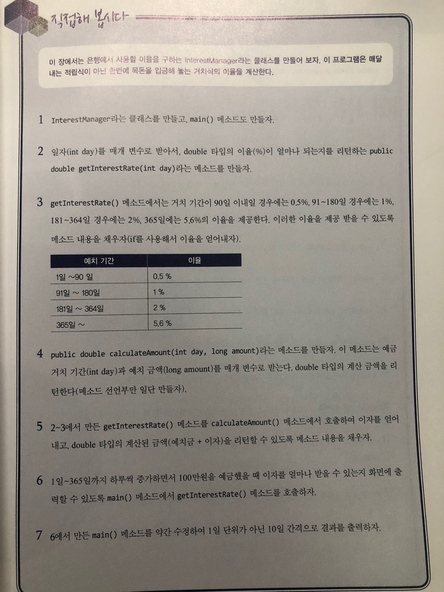

# 직접해 봅시다

# 정리해 봅시다
1. if 문장의 소괄호 안에는 어떤 타입의 결과가 제공되어야 하나요?

    > boolean

2. if 조건에 맞지 않는 모든 경우를 처리할 때 사용하는 예약어는 뭔가요?

   > else

3. switch를 사용할 수 있는 기본 자료형의 타입에는 어떤 것들이 있나요?

   > long을 제외한 정수 및 Enum이 사용가능 하다 JDK 7 부터는 String도 사용 가능

4. switch블록 안에서 비교 대상값 앞에 사용하는 예약어는 무엇인가요?
   
    > case

5. switch 조건을 빠져나가도록 하는 예약어는 무엇인가요?

   > break

6. switch 조건들에 맞지 않을 때 기본 처리를 하기 위한 예약어는 무엇인가요?

   > default

7. while 문의 소괄호 안에는 어떤 형태의 결과가 제공되어야 하나요?

   > boolean

8. while 문을 무조건 한번은 실행하게 하려면 어떻게 해야 하나요?

   > do-while 문 사용

9. while문을 마음대로 빠져나가게 하려면 어떤 예약어를 사용하면 되나요?

   > break

10. while문의 중간에 while문의 소괄호 점검 구문으로 건너뛰도록 할 때 사용하는 예약어는 무엇인가요?

    > continue

11. for루프의 소괄호안의 가장 첫 구문(첫 세미 콜론 앞의 문장)은 for루프가 수행되는 동안 몇 번 수행되나요?

    > 1번

12. for루프의 소괄호 안의 중간에 있는 구문은 어떤 타입의 결과가 제공되어야 하나요?

    > boolean

13. for루프의 소괄호 안의 마지막에 있는 구문에서는 어떤 작업을 수행하나요?

    > index를 증가하거나 감소하는 작업을 수행
