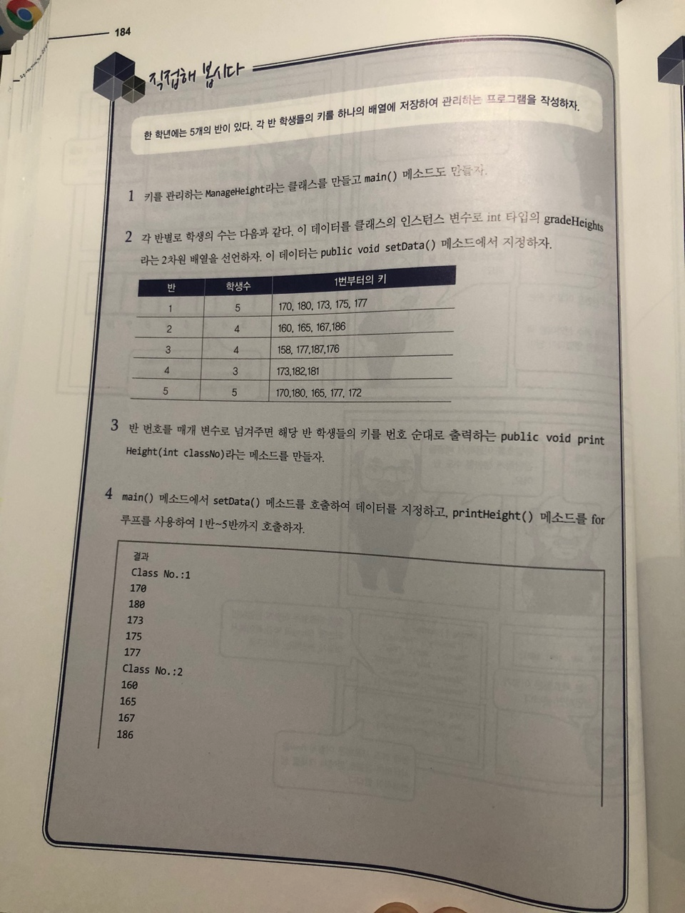
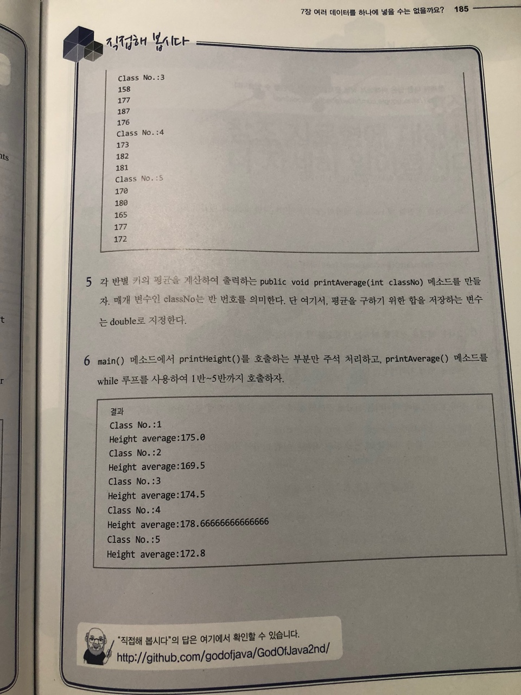

# 직접해 봅시다



# 정리해 봅시다
1. 배열을 선언할 때 어떤 기호를 변수명의 앞이나 뒤에 사용해야 하나요?

    > []
```java
    int[] arr = new int[1];
    int arr1[] = new int[1];
```

2. 배열의 첫번째 위치는 0인가요? 1인가요?

   > 0

3. 배열을 선언할 때 boolean 배열의 크기만 지정했다면 boolean 배열의 [0] 위치에 있는 값은 무엇인가요?

   > false
   
4. ArrayIndexOutOfBoundsException 이라는 것은 언제 발생하나요?

   > 선언한 배열의 크기를 벗어나는 index에 접근하려고 했을때
   
5. 중괄호를 이용하여 배열을 초기화 할 때 중괄호 끝에 반드시 어떤 것을 입력해 주어야 하나요?

   > ;
   
6. 2차원 배열을 정의할 때에는 대괄호를 몇 개 지정해야 하나요?

   > 2개
   
7. 배열을 쉽게 처리해주는 for 문의 문법은 어떻게 되나요?

```java
int[]arr = new int[1];
for(int value:arr) {
    System.out.println(value);
}
```

8. 자바 프로그램에 데이터를 전달해 주려면 클래스 이름 뒤에 어떻게 구분하여 나열하면 되나요?

   > 공백으로 구분하면 된다
   > 
   > java ArrayMain a b c d e

9. 자바 프로그램이 시작할 때 전달 받는 내용은 어떤 타입의 배열인가요?

   > String[]
