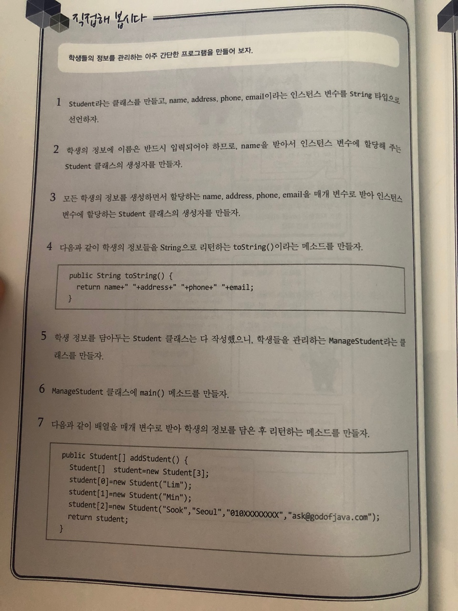
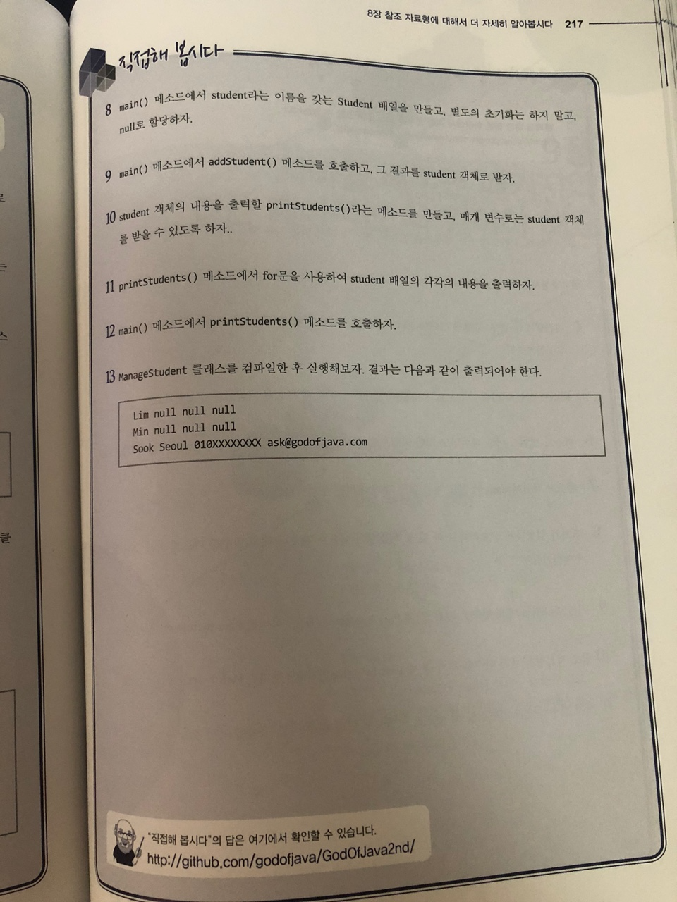

# 직접해 봅시다

# 정리해 봅시다
1. 생성자는 반드시 만들어야 하나요?

   > 모든 클래스는 생성자가 반드시 존재해야 하지만 아무런 생성자가 존재하지 않으면 컴파일러가 기본 생성자를 자동으로 생성해주기 때문에
   > 눈에 보이는건 반드시 있지 않아도 된다

2. 만약 매개변수가 있는 생성자를 만들고, 매개변수가 없는 기본 생성자를 호출하면 어떻게 될까요?

   > 기본생성자가 아닌 다른 생성자를 만들면 컴파일러가 기본 생성자를 자동으로 생성해주지 않기때문에 컴파일 에러가 발생
   
3. 생성자의 개수는 제한이 있나요?

   > X
    
4. 인스턴스의 변수와 매개변수나 메소드 내에서 생성한 변수와 구분하기 위해서 사용하는 키워드는 무엇인가요?

   > this
   
5. 메소드 선언시 리턴 타입으로 지정한 데이터를 넘겨줄 때 사용하는 키워드는 무엇인가요?

   > return
   
6. 메소드 선언시 아무 데이터도 리턴 타입으로 넘겨주지 않겠다는 것을 지정하는 키워드는 무엇인가요?

   > void
   
7. 메소드 선언에 static 이 있는 것과 없는 것의 차이는 무엇인가요?

   > 타입 앞에 static이 붙으면 인스턴스 생성을 하지 않고도 방법에 접근할 수 있다
   > 그 이유는 static 영역에 정보가 올라가 있기 때문입니다. static 영역에 올라간 정보는 프로그램이 종료 될 때까지 사라지지 않는다
   > 너무 남발하면 프로그램이 종료될 때까지 사라지지 않으니 메모리 낭비가 심하다
   
8. 필자가 엄청나게 중요하다고 한 것 중 메소드의 이름은 같으나 매개변수를 다르게 하는 것의 명칭은 무엇인가요?

   > 오버로딩
   
9. 기본 자료형을 매개변수로 넘겨 줄 때 Pass by value인가요? 아니면 Pass by reference인가요?

   > Pass by value
   
10. 참조 자료형을 매개변수로 넘겨 줄 때 Pass by value인가요? 아니면 Pass by reference인가요?

   > Pass by reference

11. 매개변수의 수가 가변적일 때 메소드 선언시 타입과 변수 이름 사이에 어떤 것을 적어줘야 하나요?

   > ...
