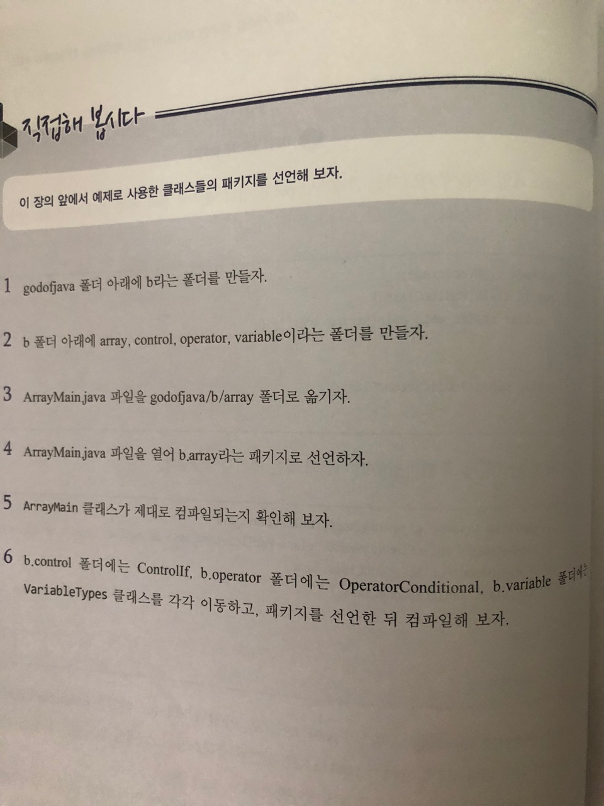

# 직접해 봅시다

# 정리해 봅시다
1. 패키지를 선언할 때 사용하는 예약어는 무엇인가요?

   > package

2. 패키지 선언은 클래스 소스 중 어디에 위치해야 하나요?

   > 가장 위에

3. 패키지를 선언할 때 가장 상위 패키지의 이름으로 절대 사용하면 안되는 단어는 무엇인가요?

   > java

4. 패키지 이름에 예약어가 포함되어도 되나요?

   > 중간에라도 예약어가 패키지의 이름으로 선언되어도 안된다

5. import는 클래스 내에 선언해도 되나요?

   > import는 클래스 선언 전에 명시되어 있어야만 한다.

6. 같은 패키지에 있는 클래스를 사용할 때 import를 해야 하나요?

   > 같은 패키지 내의 클래스와 java.lang 패키지에 있는 클래스는 별도로 import할 필요가 없다.

7. 특정 패키지에 있는 클래스들을 모두 import할 때 사용하는 기호는 무엇인가요?

   > *

8. 클래스에 선언되어 있는 static한 메소드나 변수를 import하려면 어떻게 선언해야 하나요?

   > import static

9. 접근 제어자 중 가장 접근 권한이 넓은 (어떤 클래스에서도 접근할 수 있는) 것은 무엇인가요?

   > public

10. 접근 제어자 중 가장 접근 권한이 좁은 (다른 클래스에서는 접근할 수 없는) 것은 무엇인가요?

   > private

11. 접근 제어자 중 같은 패키지와 상속관계에 있는 클래스만 접근할 수 있도록 제한하는 것은 무엇인가요?

   > protected

12. Calculate.java라는 자바 소스가 있을 경우, 그 소스 내에는 Calculate라는 클래스외에는 ( )으로 선언된 클래스가 있으면 안된다. 여기서 괄호 안에 들어가야 하는 것은 무엇인가요?

   > public
